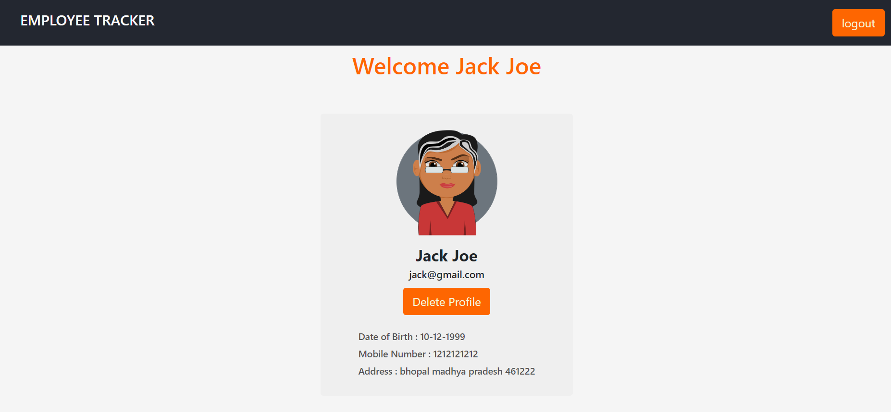

### EMPLOYEE MANAGEMENT TOOL :
    This is a Fullstack website which is used to maintain records of the employee in firm.
    Technology Used :
        Frontend - HTML,CSS, Bootstrap.
        Backend - Flask.
        RestApi - Flask-restful.
        Database - Sqlite.
        Containerise - Docker and Docker-Compose.
    Credentials of admin user:
        email - mayur.dogne@gmail.com
        password - Mayur@123
    In order to run this application simply run the run.py file.
    Locating at advancePython directory run command :
        Python run.py
    Host : localhost
    Port : 5000
        
#### Directory structure :

* Employee :
    This is the root directory of our application.
    
    * Static : It contains static content our images and css part.

    * Template : Containes our webpages.

        * admin holds pages of admin portal.
        * inc contains include file like navbar,footer,message.html etc.
    * __init__ : All the modules and our application is initialised here.

    * api.py : Contains marsh-mallow class.

    * forms.py : Contain all the forms which are created using classes and wtff module.

    * models.py : Tables are created using classes ans ORM.

    * routes.py : It contains all the views and their urls.

#### Some path for API test :

        Api display fields id,firstName,lastName,phoneNumber,dob,address. 
        Return type is application/json.

* localhost:5000/api :
    
        Supports two methods "GET" and "POST"
        Return all the users present in database.

* localhost:5000/api/<int:id> :

        Support methods "PUT","DELETE" and "GET".
        we have to pass id of the user in order use this api.
        Return User with this passes id.

* localhost:5000/searchApi :

        Return all the users whose firstName is similar to the passed parameter "name".
            param = {'name':"user input"}

#### Some views in routes: 

        Return type is Html files.

* login() : to login the registered user.
* register() : register the user.
* logout() : end the session of user.
* admin() : display all the employee of firms except admin.
* employeeDetail(): Display detail of the each employee in admin panel
* delete() : Delete the record from admin panel.
* profile() : Display of the logged in user.
* home() : Our home page.
* session_handlar() : handles the user session.

#### LOGIN :

#### REGISTRATION :

#### PROFILE : 

#### EMPLOYEE DETAILS :

#### HOME : 

